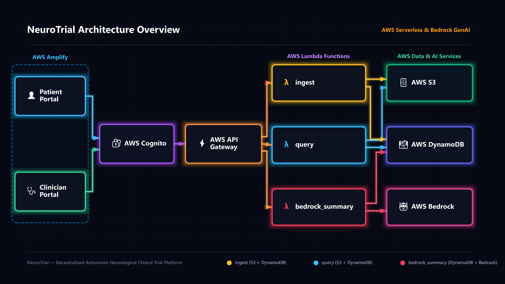
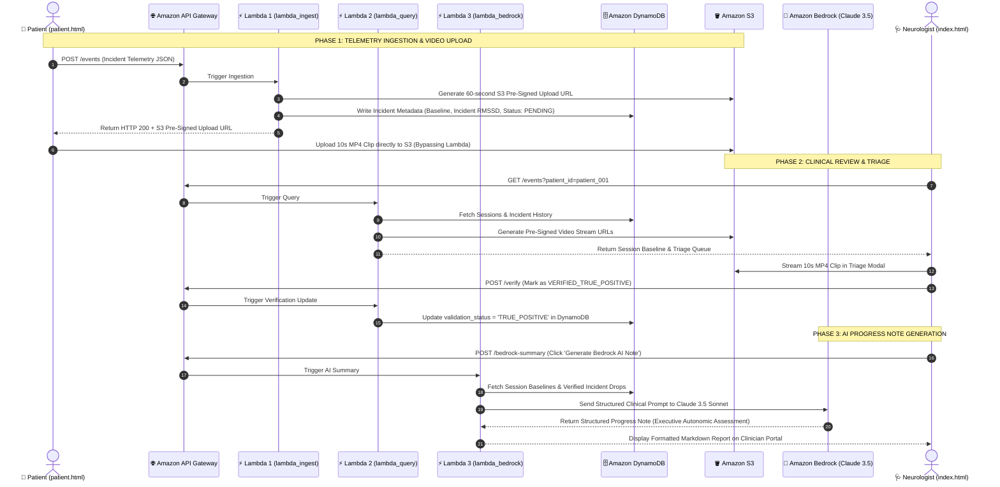

# Quantifying the Relationship Between Stress and Head Oscillations in Nystagmus Patients: Comprehensive System & Clinical Documentation

## 1. Executive Summary & Clinical Context

### 1.1 Clinical Background
**Nystagmus** is an involuntary, rhythmic, oscillatory movement of the eyes, affecting approximately 1 in 1,000 individuals globally. In conditions such as **Infantile Nystagmus Syndrome (INS)** and acquired cervical/vestibular tremors, patients frequently exhibit compensatory or concurrent **head oscillations** (often termed *head nodding* or *head tremor*).

Historically, clinical neurology has debated whether these involuntary head oscillations are:
1. Purely neurological motor phenomena originating strictly from the ocular-motor neural circuitry.
2. Dynamically modulated or triggered by the **Autonomic Nervous System (ANS)** under acute physiological stress (sympathetic arousal and vagal parasympathetic withdrawal).

### 1.2 Core Research Hypothesis
$$\text{Acute Autonomic Stress (Vagal Tone Suppression / Sympathetic Surge)} \iff \text{Head Oscillation Trigger Frequency}$$

If head oscillations correlate with acute drops in Heart Rate Variability (specifically RMSSD), it proves that nystagmus episodes have an autonomic stress component. This opens the door to non-invasive interventions: **targeted biofeedback, wearable autonomic regulation, and stress-reduction therapies** that could substantially decrease episode frequency and improve patient quality of life.

<!-- -- -->

## 2. System Architecture & Modalities

<div align="center">
  
</div>

<br/>

The **NeuroTrial** platform is designed as an end-to-end, zero-install, decentralized clinical trial system consisting of three integrated layers:

```
┌────────────────────────────────────────────────────────────────────────────────────────┐
│                        LAYER 1: PATIENT RECORDING STUDIO (WEB)                         │
│                           URL: http://<host>/patient.html                              │
├────────────────────────────────────────────────────────────────────────────────────────┤
│ • Web Bluetooth API (GATT 0x2A37) connecting directly to Polar H9 ECG chest strap      │
│ • Client-side MediaPipe Face Mesh tracking Landmark #1 (Nose Tip)                      │
│ • Exponential Moving Average (EMA α=0.4) low-pass filter & direction reversal counter  │
│ • 5-Minute Quiet Resting Baseline Calibration Protocol (60s Windows → Median RMSSD)   │
│ • 10-Second Circular Rolling Video Buffer (5s Pre + 5s Post trigger)                   │
│ • On-screen real-time telemetry HUD & visual alert: "🚨 OSCILLATION DETECTED!"         │
└────────────────────────────────────────────────────────────────────────────────────────┘
                                           │
                                           ▼ (Telemetry & Video Upload)
┌────────────────────────────────────────────────────────────────────────────────────────┐
│                       LAYER 2: AWS SERVERLESS BACKEND (CLOUD)                          │
├────────────────────────────────────────────────────────────────────────────────────────┤
│ • Amazon API Gateway (REST API endpoints: /events, /summary, /validate)                │
│ • AWS Lambda Functions:                                                                │
│     - lambda_ingest.py: Parses telemetry & issues 60s S3 Pre-Signed Upload URLs        │
│     - lambda_query.py: Fetches patient sessions, baseline metrics, & triage queue      │
│     - lambda_bedrock_summary.py: GenAI Copilot (Claude 3.5 Sonnet / Amazon Nova)       │
│ • Amazon DynamoDB: Longitudinal NoSQL store for patient metadata & validated incidents │
│ • Amazon S3: Encrypted private video vault storing 10-second MP4 incident clips        │
│ • AWS Amplify / CloudFront: Zero-idle-cost global HTTPS CDN deployment                 │
└────────────────────────────────────────────────────────────────────────────────────────┘
                                           │
                                           ▼ (Real-Time Triage & Review)
┌────────────────────────────────────────────────────────────────────────────────────────┐
│                        LAYER 3: CLINICIAN ACCESS PORTAL (EHR)                          │
│                            URL: http://<host>/index.html                               │
├────────────────────────────────────────────────────────────────────────────────────────┤
│ • Decoupled clinician URL for neurologists and researchers                             │
│ • Human-in-the-Loop (HITL) video triage queue (True Positive vs. False Positive)       │
│ • Clean session charts plotting Baseline RMSSD and Verified True Positives only        │
│ • Amazon Bedrock GenAI progress note generator & circadian cluster analyzer            │
│ • Cross-page live synchronization via LocalStorage & DynamoDB updates                  │
└────────────────────────────────────────────────────────────────────────────────────────┘
```

---

## 3. Mathematical & Algorithmic Specifications

### 3.1 Heart Rate Variability: RMSSD Calculation
The primary physiological biomarker utilized throughout the system is the **Root Mean Square of Successive Differences (RMSSD)** between normal heartbeats (R-R intervals). RMSSD is mathematically defined as:

$$\text{RMSSD} = \sqrt{\frac{1}{N-1} \sum_{i=1}^{N-1} (RR_{i+1} - RR_i)^2}$$

Where:
* $RR_i$ is the $i$-th R-R interval in milliseconds.
* $N$ is the total count of valid R-R intervals within the evaluation window ($300\text{ ms} \le RR_i \le 2000\text{ ms}$).

### 3.2 5-Minute Quiet Resting Baseline Calibration Protocol
To avoid capturing artifactual stress (such as patient setup or movement), the system implements a standardized 5-minute calibration protocol:
1. **Duration:** 300 seconds of quiet rest with eyes open, looking forward.
2. **Windowing:** The raw R-R interval stream is divided into non-overlapping 60-second windows:
   $$W_k = \{ RR_t \mid (k-1) \times 60 \le t < k \times 60 \}, \quad k \in \{1, 2, 3, 4, 5\}$$
3. **Window RMSSD:** Compute $\text{RMSSD}(W_k)$ for each 60-second chunk.
4. **Established Baseline:** The session baseline is the **Median** of all valid chunk RMSSDs:
   $$\text{Baseline RMSSD}_{\text{session}} = \text{Median}\Big(\big[\text{RMSSD}(W_1), \text{RMSSD}(W_2), \dots, \text{RMSSD}(W_5)\big]\Big)$$

Taking the median eliminates extreme outliers caused by occasional ectopic beats or brief posture shifts.

### 3.3 Facial Optical Tracking & Oscillation Reversal Filter
Head movement is quantified in real time from live camera frames:
1. **Nose Landmark Target:** The coordinate $(X_{\text{raw}}, Y_{\text{raw}})$ of **MediaPipe Face Mesh Landmark `#1` (Nose Tip)** is extracted at 30 FPS.
2. **Exponential Moving Average (EMA) Low-Pass Filter:**
   $$\hat{X}_t = \alpha \cdot X_{\text{raw}, t} + (1 - \alpha) \cdot \hat{X}_{t-1}, \quad \text{where } \alpha = 0.4$$
3. **Optical Velocity Computation:**
   $$V_t = \hat{X}_t - \hat{X}_{t-1}$$
4. **Direction Reversal Detection:**
   $$\text{Condition: } |V_t| \ge 1.0\text{ px/frame} \quad \text{and} \quad V_t \cdot V_{t-1} < 0$$
   Each time this condition evaluates to true, the direction change counter increments: $\text{Reversals} \leftarrow \text{Reversals} + 1$.
5. **Inactivity Timeout:** If no reversal occurs within $1.5\text{--}2.0\text{ seconds}$, $\text{Reversals}$ resets to 0.
6. **Trigger Condition:** When $\text{Reversals} \ge 4$, an oscillation incident is flagged.

### 3.4 Acute Drop in Parasympathetic HRV (RMSSD)
When an oscillation occurs, the system computes the preceding 60-second incident RMSSD $[T_{\text{trigger}} - 60\text{s},\, T_{\text{trigger}}]$ and determines the relative drop in parasympathetic tone:

$$\text{Drop in Parasympathetic HRV \%} = \frac{\text{Baseline RMSSD}_{\text{session}} - \text{Incident RMSSD}_{60\text{s}}}{\text{Baseline RMSSD}_{\text{session}}} \times 100$$

---

## 4. Hardware & Bluetooth Telemetry Specifications

### 4.1 Polar H9 ECG Chest Strap
* **Sensor Type:** Bipolar chest strap ECG with dual electrical contact pads.
* **Sampling Resolution:** 1 millisecond R-R interval measurement accuracy ($1/1024\text{th}$ second internal clock).
* **Protocol:** Bluetooth Low Energy (BLE) Heart Rate Profile (HRP).
* **Service UUID:** `0x180D` (Heart Rate Service).
* **Characteristic UUID:** `0x2A37` (Heart Rate Measurement).

### 4.2 Web Bluetooth API In-Browser Ingestion
Modern browsers (Google Chrome, Microsoft Edge, Brave) connect directly to the Polar H9 via JavaScript:
```javascript
const device = await navigator.bluetooth.requestDevice({
  filters: [{ services: ['heart_rate'] }],
  optionalServices: ['battery_service']
});
const server = await device.gatt.connect();
const service = await server.getPrimaryService('heart_rate');
const char = await service.getCharacteristic('heart_rate_measurement');
await char.startNotifications();
```

### 4.3 Clinical Session Lifecycle Protocol
* **Active Session Lock & Completion:** Clicking **"⏹️ End Active Session"** locks the current session record, marks status as `COMPLETED`, records the termination timestamp (`ended_at`), and launches a clinical session summary dialog.
* **New Session Creation & Baseline Recalibration:** When **"Start New Session"** is initiated, a new session ID (`sess_001_02`, `sess_001_03`, etc.) is generated. The system automatically resets the 5-minute quiet resting baseline calculation overlay (`05:00` timer) and clears transient motion buffers to establish a fresh physiological baseline for the new trial scenario.

### 4.4 Telemetry-Gated Video Capture & Bluetooth Edge-Case Protocol
To ensure strict clinical trial integrity and prevent uncalibrated, ungrounded recordings, the system implements telemetry-gated video persistence:

1. **Strict Telemetry-Gated Video Saving:**
   * **Rule:** Videos are saved **ONLY** if active physiological heart rate variability (HRV) readings are being received from the Polar H9 chest strap OR the simulation stream is active.
   * **Inhibited Recording on Disconnection:** If the Bluetooth strap disconnects or the user clicks **"Stop Simulation"**, the video buffer is paused. Any detected head oscillation is prevented from saving video to EHR/S3.
2. **Interactive Telemetry Prompt:**
   * When an oscillation occurs during telemetry loss, the system immediately presents an interactive prompt banner:
     > **"⚠️ Live Telemetry Required — Video Recording Inhibited"**
     > *Clinical trial protocols require simultaneous heart rate variability telemetry. Please connect your Polar H9 strap or start the simulated stream.*
   * Action buttons allow the user to immediately connect Polar H9 or launch the simulation with 1 click.
3. **Simulation Stream Toggle:**
   * Clicking **"⚡ Start Simulated Bluetooth Stream (Testing)"** toggles the button to **"⏹️ Stop Simulation"** (red-bordered active state) and streams simulated R-R intervals (82–94 BPM).
   * Clicking **"⏹️ Stop Simulation"** cleanly tears down the generator, resets the button, sets heart rate to `— BPM`, and pauses video recording until re-engaged.
4. **Studio Layout Architecture:**
   * **Left Viewport:** Real-time webcam feed, MediaPipe facial mesh landmark tracking (green dot at nose tip `#1`), and continuous optical velocity calculation.
   * **Right Side Panel:** Dedicated Polar H9 hardware connection controls, simulation toggle, live heart rate (BPM), session baseline RMSSD, live 60s window RMSSD, and video buffer readiness indicators.

---

## 5. AWS Cloud Infrastructure Architecture

### 5.1 Cloud Services Summary
* **AWS Amplify:** Global HTTPS hosting for the patient and clinician single-page web applications.
* **Amazon API Gateway:** Exposes managed REST endpoints (`POST /events`, `GET /events`, `POST /summary`, `POST /validate`).
* **AWS Lambda:**
  * `lambda_ingest.py`: Validates telemetry payloads and generates S3 Pre-Signed Upload URLs.
  * `lambda_query.py`: Retrieves patient session histories and pending video triage items.
  * `lambda_bedrock_summary.py`: Invokes Amazon Bedrock foundation models to produce clinical reports.
* **Amazon DynamoDB:** NoSQL database storing structured patient records, session baselines, and verified incident telemetry.
* **Amazon S3:** S3 bucket (`neurostress-validation-videos-...`) storing 10-second MP4 video recordings.
* **Amazon Bedrock:** Foundation model integration (`anthropic.claude-3-5-sonnet` / `amazon.nova`) for clinical intelligence.

### 5.2 DynamoDB Schema Design
**Table Name:** `NeuroStress-Telemetry-Events`  
* **Partition Key (PK):** `patient_id` (String, e.g. `patient_001`)
* **Sort Key (SK):** `timestamp` (String, ISO 8601, e.g. `2026-09-10T14:30:00Z`)

**Attributes:**
* `session_id`: String (e.g. `sess_20260910_01`)
* `event_id`: String (e.g. `evt_live_abc123`)
* `baseline_rmssd`: Number (e.g. `44.5`)
* `incident_rmssd`: Number (e.g. `18.2`)
* `stress_drop_pct`: Number (e.g. `59.1`)
* `bpm`: Number (e.g. `91`)
* `s3_video_key`: String (e.g. `videos/patient_001/nod_20260910_143000.mp4`)
* `validation_status`: String (`PENDING_REVIEW` | `TRUE_POSITIVE` | `FALSE_POSITIVE`)
* `doctor_notes`: String

### 5.3 Serverless Microservices & Lambda Execution Sequence



### 5.4 Role-Based Access Control (RBAC) & Patient Data Isolation
To comply with HIPAA, GDPR, and FDA 21 CFR Part 11 requirements for decentralized clinical trials:
* **Amazon Cognito User Groups:** Two distinct user groups manage permissions:
  * `Clinicians`: Full access to multi-patient rosters, triage queue validation, video review, and Bedrock AI notes.
  * `Patients`: Scoped exclusively to their own `custom:patient_id` or Cognito `sub`.
* **Zero-Trust Backend Scoping:**
  * In `lambda_ingest.py`, telemetry records and S3 video upload paths (`clips/{patient_id}/...`) are strictly derived from verified JWT token claims. Request body overrides are rejected.
  * In `lambda_query.py` and `lambda_bedrock_summary.py`, verification updates and Bedrock clinical note generation are restricted to callers in the `Clinicians` group (returning `HTTP 403 Forbidden` for unauthorized patient tokens).
* **Client-Side Route Guarding (`auth_manager.js`):**
  * Prevents patient accounts from loading the Clinician EHR Portal (`index.html`), automatically redirecting them to the Patient Studio (`patient.html`) with a security alert banner.
  * In the Patient Studio, locks patient selection to the authenticated subject ID to prevent accidental data contamination.

---

## 6. User Experience & Portals

### 6.1 Patient Recording Studio (`patient.html`)
* Accessible globally with zero installation.
* Prompts patient for intake details (Name, Age, Diagnosis, Session Goal).
* Live video display with active **green dot anchored to nose tip** and real-time HUD.
* 5-Minute resting baseline calibration modal with timer and progress bar.
* Visual **"🚨 OSCILLATION DETECTED!"** indicator with 10-second capture progress bar.

### 6.2 Clinician Access Portal (`index.html`)
* Comprehensive longitudinal view across all clinical sessions.
* **Incident Triage Queue:** Neurologists view pending video clips, inspect on-screen telemetry, and click `✓ Verify True Positive` or `✗ Dismiss False Positive`.
* **Clean Session Graphs:** Strictly plots the **Established Baseline RMSSD** line and **Verified True Positive** oscillation points. False positives and motion artifacts are excluded from the graph to preserve diagnostic fidelity.
* **AI Copilot Button:** Generates exportable, structured clinical consultation notes powered by Amazon Bedrock.

---

## 7. Standalone Python Edge Tracker (`OscillationTracker.py`)

For laboratory or desktop environments, `OscillationTracker.py` provides identical tracking parity:
* **Dual-Threaded Architecture:**
  * **Main Thread (OpenCV loop):** 30 FPS camera feed, MediaPipe Face Mesh tracking, rolling RAM buffer, MP4 writer, and CSV logger.
  * **BLE Background Thread (asyncio + bleak):** Continuous GATT notification handler with automatic reconnect logic.
* **Thread Safety:** Shared data access protected via `threading.Lock()`.
* **Async AWS Dispatch:** Background worker thread uploads video clips to S3 and metadata to API Gateway without dropping OpenCV video frames.

---

## 8. Verification & Test Procedures

1. **Web Bluetooth Test Simulation:** Click `⚡ Start Simulated Bluetooth Stream` on `patient.html` to run end-to-end tests without physical hardware.
2. **Nose Tracking Verification:** Move in front of the webcam; verify that the green dot (`#10b981`) and coordinate display follow the nose tip without freezing.
3. **Baseline Finalization:** Click `⚡ Finalize Baseline Now` to establish the baseline and transition to Active Tracking.
4. **Oscillation Trigger:** Shake head or click `🚨 Trigger Test Oscillation`; observe the 10-second video capture and telemetry sync to the clinician queue.
5. **Clinician Validation:** Open `index.html`, verify the new episode appears under pending review, validate as True Positive, and observe the updated session graph.

---

## 9. Conclusion & Hackathon Submission Impact

**NeuroStress AI** bridges the gap between consumer wearables, client-side computer vision, and cloud serverless computing. By enabling global, zero-install clinical trial participation and providing automated AI-assisted clinician triage on AWS, this platform transforms nystagmus research from episodic hospital testing into continuous, objective, real-world science.
